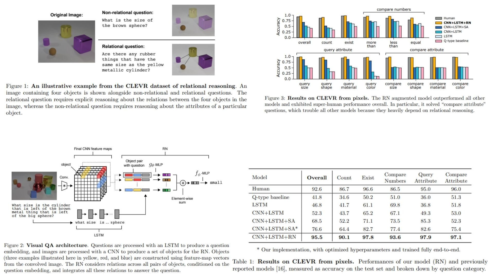

# 📟 RN-Vision-Replication — Relation Networks for Visual Reasoning

This repository provides a **PyTorch-based replication** of  
**Relation Networks — Santoro et al., NeurIPS 2017**.

The focus is on **faithfully reproducing the original vision reasoning pipeline**  
with a clean, modular, and research-oriented implementation.

- Learns **object-centric visual representations** 🜏  
- Performs **explicit relational reasoning** between all object pairs 🜂  
- Modular and easy-to-extend **research-oriented codebase** 🜄  

**Paper reference:**  [Relational Reasoning for Visual Intelligence — Santoro et al., 2017](https://arxiv.org/abs/1706.01427) 📄

---

## 🧠 Overview — Relational Visual Reasoning Pipeline



The core idea:

> Intelligence emerges from **relations between objects**, not objects alone.

Instead of directly mapping  
$image \rightarrow y$,  
the model is structured as:

$$
x \;\longrightarrow\; \{o_1, o_2, ..., o_N\} \;\longrightarrow\; g_\theta(o_i, o_j) \;\longrightarrow\; f_\phi(\sum r_{ij})
$$

Where:
- $x$ = input image  
- $o_i$ = object representation  
- $g_\theta$ = relational reasoning module  
- $f_\phi$ = decision module  
- $y$ = final prediction  

The model reasons by explicitly computing **all object-object relations**.

---

## 👁 Vision Encoder — Image to Object Decomposition

Given an input image $x$, a CNN backbone produces a spatial feature map:

$$
F(x) \in \mathbb{R}^{H \times W \times C}
$$

Each spatial cell is treated as an object:

$$
o_i = [F(x)_{h,w}, \; p_x, p_y]
$$

Where:
- $F(x)_{h,w}$ = visual feature vector  
- $(p_x, p_y)$ = normalized spatial coordinates  

This converts the image into a **set of visual objects**:

$$
O = \{o_1, o_2, ..., o_N\}
$$

---

## 🔗 Relational Reasoning — Object Pair Modeling

For every object pair $(o_i, o_j)$, a relation vector is computed:

$$
r_{ij} = g_\theta([o_i, o_j])
$$

Where:
- $[\cdot,\cdot]$ = concatenation  
- $g_\theta$ = shared MLP  

All relations are aggregated:

$$
R = \sum_{i,j} r_{ij}
$$

This creates a **global relational representation**.

---

## 🎯 Decision Module — Relational Inference

The final prediction is produced by:

$$
y = f_\phi(R)
$$

Where:
- $f_\phi$ = MLP classifier  

This architecture enforces:

> Reasoning = aggregation of pairwise relations

---

## 🧠 What the Model Learns

- Object interactions
- Spatial relationships
- Counting & comparison
- Attribute binding
- Compositional logic
- Scene structure

All through **explicit relational computation**.

---

## 📦 Repository Structure

```bash
RN-Vision-Replication/
├── src/
│   ├── backbone/
│   │   └── encoder.py          # Image → feature map extractor (CNN)
│   │
│   ├── objects/
│   │   └── object_encoder.py   # Feature map → object set (grid cells as objects)
│   │
│   ├── relation/
│   │   ├── g_theta.py          # gθ(o_i, o_j): relation MLP
│   │   ├── f_phi.py            # fφ(Σ relations): decision MLP
│   │   └── rn.py               # Full Relation Network module
│   │
│   │
│   ├── model/
│   │   └── rn_vision.py       # Full Image → Objects → RN → Output pipeline
│   │
│   ├── loss/
│   │   └── loss.py            # Task-specific loss (classification, regression, etc.)
│   │
│   │
│   └── config.py
│
├── images/
│   └── figmix.jpg   
│
├── requirements.txt
└── README.md
```
---


## 🔗 Feedback

For questions or feedback, contact: [barkin.adiguzel@gmail.com](mailto:barkin.adiguzel@gmail.com)
